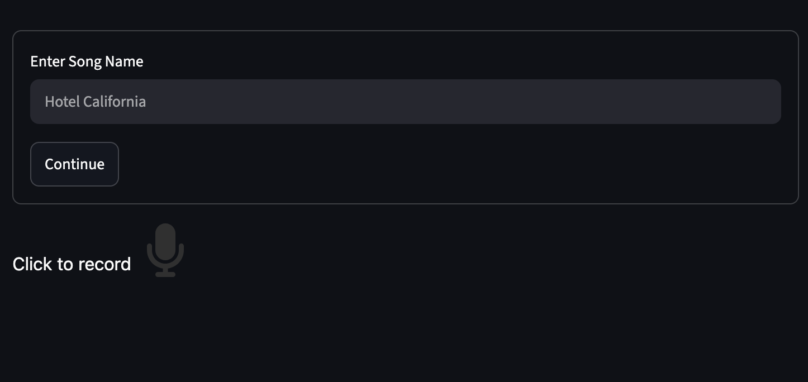

# Guitar Sync
A simple & simple app to manage your song covers



---

# About
This project allows users to record and save their guitar covers!

# Motivation
Whenever I played the guitar and I wanted to record my covers, I would either record a video on the cameras
app or just use voice memos, and it was so cluttered and messy. I wish there was a place where I could look
at all my songs and manage them 

(well thats what this project is!)

# Tech Stack
So python was used for the entirety of the project! I used streamlit for the "frontend" website you see.

# Getting Started (PLEASE READ)
Simply download the **universal** dmg for MacOS, **add the ".dmg" extension** at the end of the file and your good to go!

When you first run it, Apple won't let you as the app as its not signed. To bypass this, simply click
"Done" when it gives you that prompt, go to `settings > Privacy & Security` and scroll down to the
security tab and click "Open Anyway" then enter your password if it requires that and thats it!

NOTE: It takes 5-10 seconds for the app to launch, so be patient please!

# Setting it up yourself

1. Clone the repository
```bash
git clone https://github.com/danizdes/guitarsync
```

2. Create a virtual environment
```bash
python -m venv env
```

3. Activate the environment

On MacOS/Linux

```bash
source env/bin/activate
```

On Windows

```bash
env\Scripts\activate
```

4. Install requirements.txt file

```bash
pip install -r requirements.txt
```

5. Now simply run this:

```bash
streamlit run streamlit/Introduction
```
NOTE: run it from the root project directory!

And there you go!

# AI Usage

All the streamlit & python code was written by myself. While I used AI for debugging, fixing errors or seeing
how a specific module worked, I used it to a similar way as looking at documentation. **NEVER** just blindly
copy pasting.

The only exception to this is create the executable build. I tried to build it myself but I just couldn't
get it to work, so I used AI to generate an executable for me.